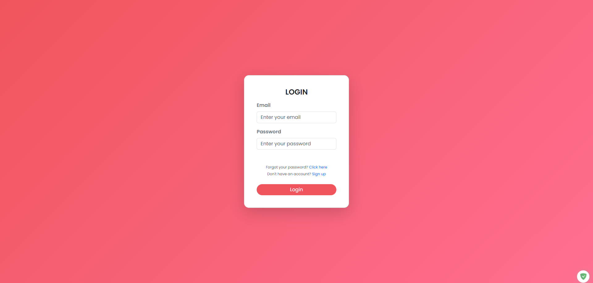
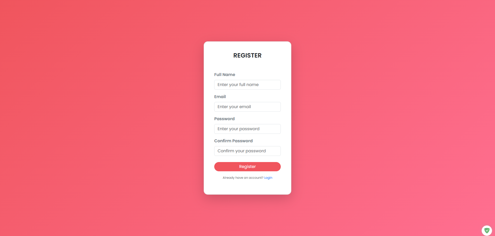
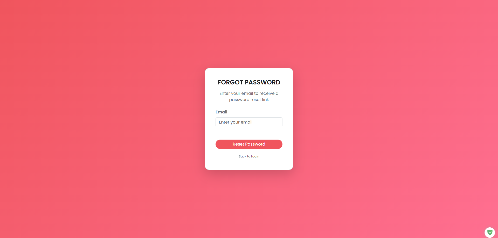
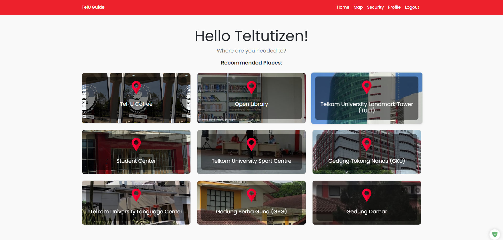
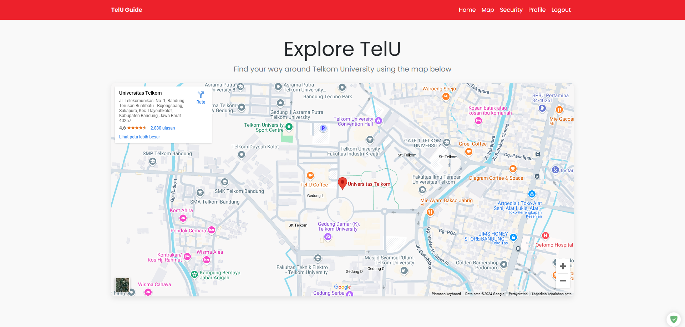
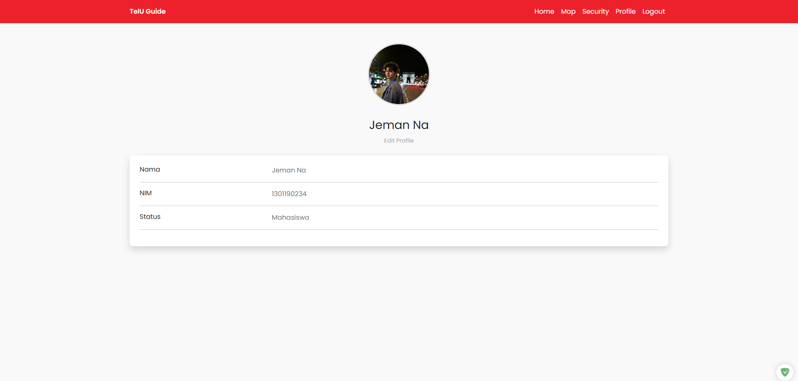
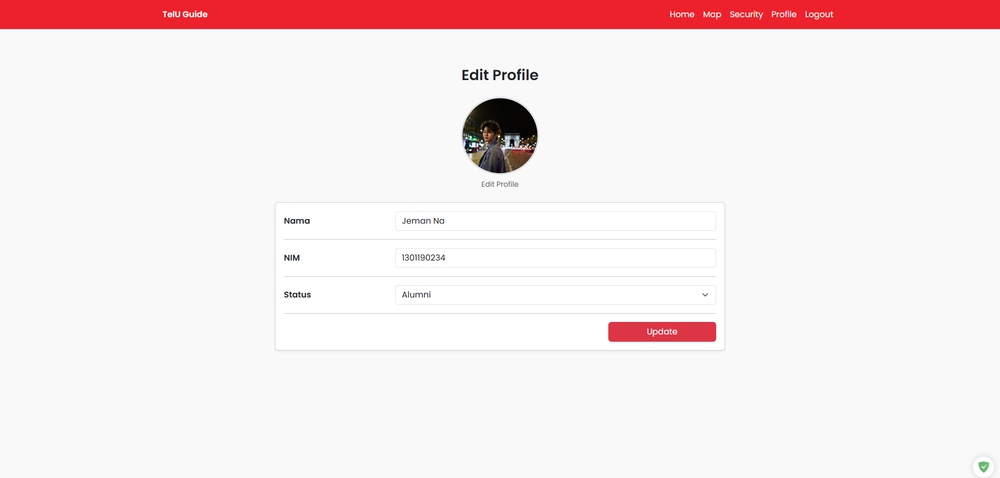
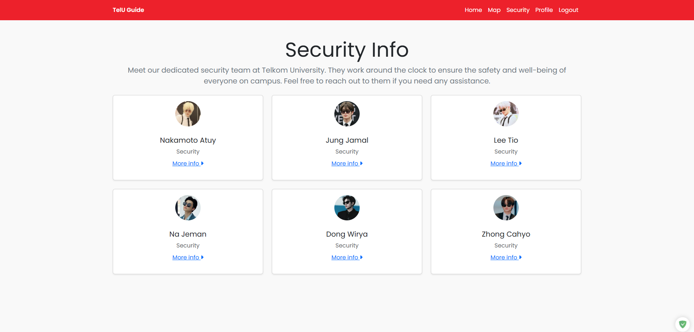
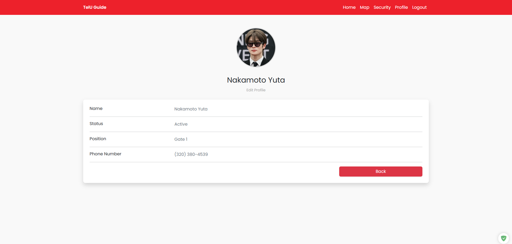
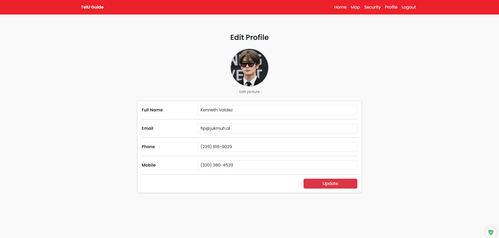

<p align="center"><a href="https://laravel.com" target="_blank"></a></p>

<p align="center">
<a href="https://github.com/laravel/framework/actions"></a>
<a href="https://packagist.org/packages/laravel/framework"></a>
<a href="https://packagist.org/packages/laravel/framework"></a>
<a href="https://packagist.org/packages/laravel/framework"></a>
</p>

## About Laravel

Laravel is a web application framework with expressive, elegant syntax. We believe development must be an enjoyable and creative experience to be truly fulfilling. Laravel takes the pain out of development by easing common tasks used in many web projects, such as:

-   [Simple, fast routing engine](https://laravel.com/docs/routing).
-   [Powerful dependency injection container](https://laravel.com/docs/container).
-   Multiple back-ends for [session](https://laravel.com/docs/session) and [cache](https://laravel.com/docs/cache) storage.
-   Expressive, intuitive [database ORM](https://laravel.com/docs/eloquent).
-   Database agnostic [schema migrations](https://laravel.com/docs/migrations).
-   [Robust background job processing](https://laravel.com/docs/queues).
-   [Real-time event broadcasting](https://laravel.com/docs/broadcasting).

Laravel is accessible, powerful, and provides tools required for large, robust applications.

## Learning Laravel

Laravel has the most extensive and thorough [documentation](https://laravel.com/docs) and video tutorial library of all modern web application frameworks, making it a breeze to get started with the framework.

You may also try the [Laravel Bootcamp](https://bootcamp.laravel.com), where you will be guided through building a modern Laravel application from scratch.

If you don't feel like reading, [Laracasts](https://laracasts.com) can help. Laracasts contains thousands of video tutorials on a range of topics including Laravel, modern PHP, unit testing, and JavaScript. Boost your skills by digging into our comprehensive video library.

## Laravel Sponsors

We would like to extend our thanks to the following sponsors for funding Laravel development. If you are interested in becoming a sponsor, please visit the [Laravel Partners program](https://partners.laravel.com).

### Premium Partners

-   **[Vehikl](https://vehikl.com/)**
-   **[Tighten Co.](https://tighten.co)**
-   **[WebReinvent](https://webreinvent.com/)**
-   **[Kirschbaum Development Group](https://kirschbaumdevelopment.com)**
-   **[64 Robots](https://64robots.com)**
-   **[Curotec](https://www.curotec.com/services/technologies/laravel/)**
-   **[Cyber-Duck](https://cyber-duck.co.uk)**
-   **[DevSquad](https://devsquad.com/hire-laravel-developers)**
-   **[Jump24](https://jump24.co.uk)**
-   **[Redberry](https://redberry.international/laravel/)**
-   **[Active Logic](https://activelogic.com)**
-   **[byte5](https://byte5.de)**
-   **[OP.GG](https://op.gg)**

## Contributing

Thank you for considering contributing to the Laravel framework! The contribution guide can be found in the [Laravel documentation](https://laravel.com/docs/contributions).

## Code of Conduct

In order to ensure that the Laravel community is welcoming to all, please review and abide by the [Code of Conduct](https://laravel.com/docs/contributions#code-of-conduct).

## Security Vulnerabilities

If you discover a security vulnerability within Laravel, please send an e-mail to Taylor Otwell via [taylor@laravel.com](mailto:taylor@laravel.com). All security vulnerabilities will be promptly addressed.

## License

The Laravel framework is open-sourced software licensed under the [MIT license](https://opensource.org/licenses/MIT).

<br><br>
---
<br><br>


# TelU Guide

**TelU Guide** is a web application designed to assist students in navigating the Telkom University campus. It is particularly beneficial for new students unfamiliar with the campus layout. Built using the **Laravel Framework v11.35.1**, TelU Guide provides an intuitive interface and features such as an interactive campus map, making campus exploration seamless.

---

## Features

### User Authentication
- **Login**: A secure system for user authentication via email and password.  
  

- **Register**: Quick and easy registration with input validation.  
  

- **Forgot Password**: Password recovery support via email.  
  

### Dashboard
A personalized dashboard for users to access essential campus information.  


### Interactive Map
An interactive map that helps users locate destinations within the campus.  


### User Profiles
- **Student Profile**: View detailed student profiles.  
  

- **Edit User Profile**: Update user information with ease.  
  

### Security Features
- **Security Information**: Access detailed information about campus security.  
  

- **Security Profiles**: Dedicated profiles for security personnel.  
  

- **Edit Security Profile**: Manage data for security personnel.  
  

---

## Installation Guide

Follow the steps below to install and set up the TelU Guide project. For additional details, refer to the official [Laravel 11 documentation](https://laravel.com/docs/11.x/installation).

### Prerequisites

Ensure your system meets the following requirements:
- **PHP**: Version **8.2 to 8.4**
- **Composer**: PHP dependency manager

For additional details, refer to the [Laravel Server Requirements](https://laravel.com/docs/11.x/deployment#server-requirements).

### Installation Steps

1. **Install PHP, Composer, and Laravel Installer**
   - If these components are not already installed, you can set them up manually or use the following command for a quick setup on Windows:
     ```powershell
     Set-ExecutionPolicy Bypass -Scope Process -Force; [System.Net.ServicePointManager]::SecurityProtocol = [System.Net.ServicePointManager]::SecurityProtocol -bor 3072; iex ((New-Object System.Net.WebClient).DownloadString('https://php.new/install/windows/8.4'))
     ```
     This command installs PHP 8.4, Composer, and the Laravel Installer automatically. For installation on other platforms, refer to their respective guides.

2. **Initialize Environment Configuration**
   - Navigate to the project directory and copy the `.env.example` file to `.env`:
     ```bash
     cp .env.example .env
     ```
   - Update the `.env` file with your environment settings, such as database credentials and application keys.

3. **Install Project Dependencies**
   - In the project directory, install the required dependencies and generate the application key:
     ```bash
     composer install
     composer update
     php artisan key:generate
     ```

4. **Start the Development Server**
   - Launch the local development server with the following command:
     ```bash
     composer run dev
     ```
   - Open your browser and visit [http://localhost:8000](http://localhost:8000) to access the application.

---

## Advanced Configuration

For advanced setup options, including server deployment and additional environment variables, consult the official [Laravel Configuration Documentation](https://laravel.com/docs/11.x/configuration).
